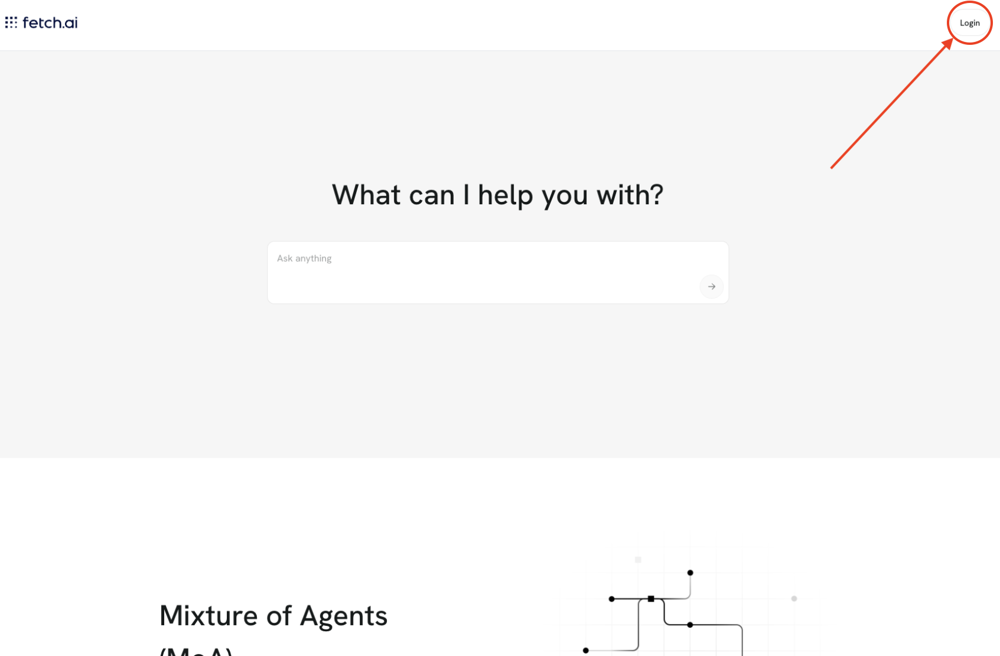
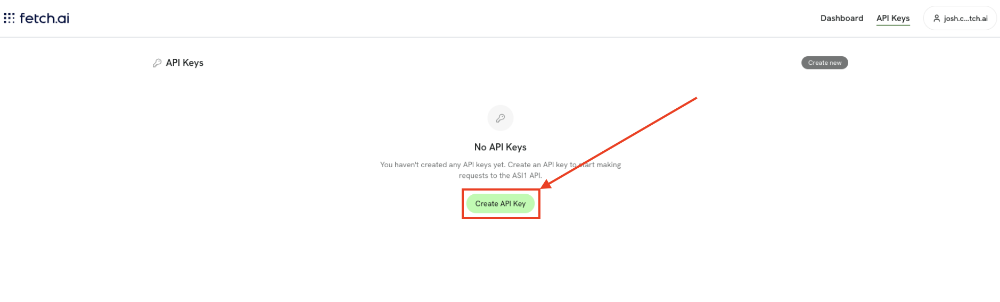
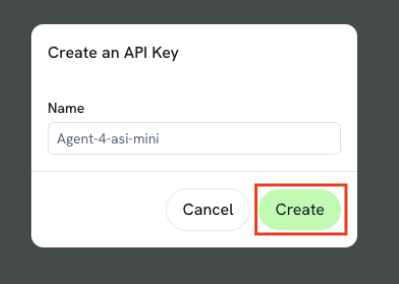
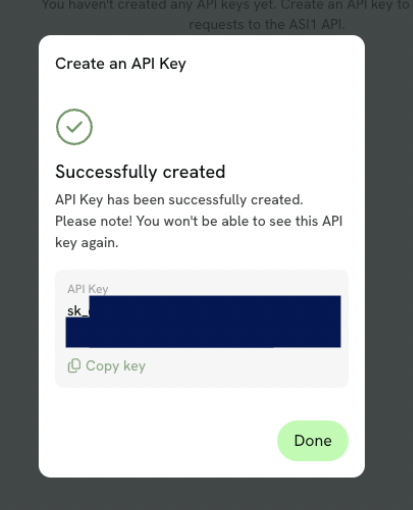
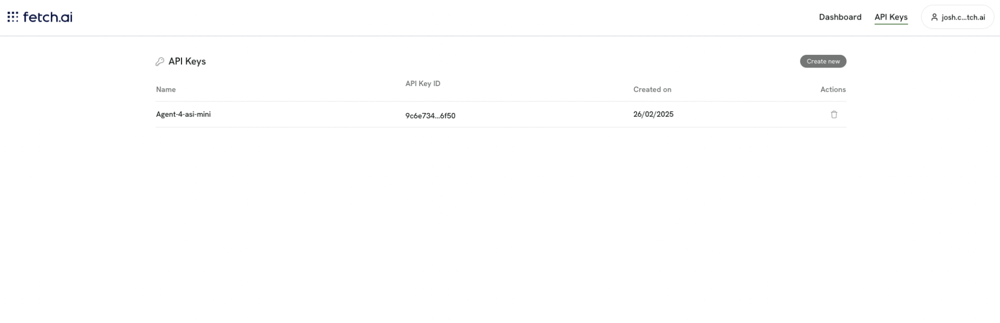

# How to get an API key

Visit [ASI1](https://asi1.ai/chat) and login.

You'll see a link in the top right to create an API Key; click that link.

Next you'll see a view as so:

Click **Create new** or **Create API Key**.

In this window give the API key a name that makes sense to you.

Then, click **Create**.

You'll now see a window which displays your API key:

Copy this API key and keep it safe!

Now you have your API key. You can manage the newly created key within the [Dashboard](https://asi1.ai/dashboard/api-keys).

