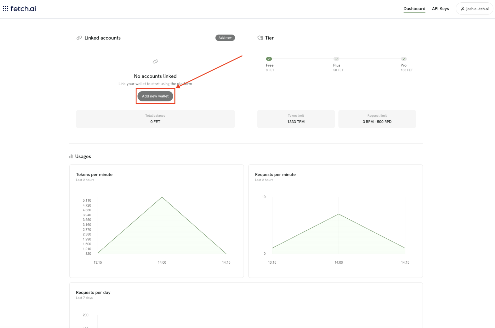
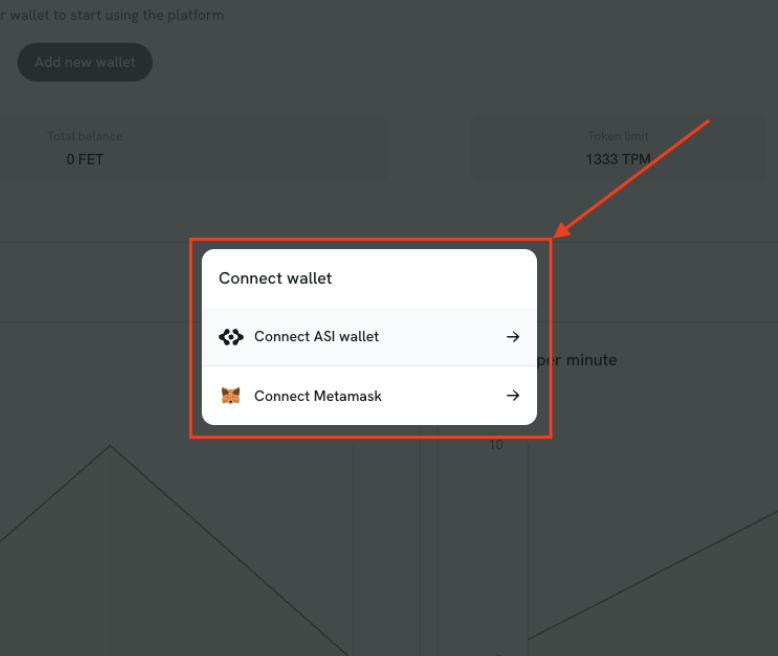
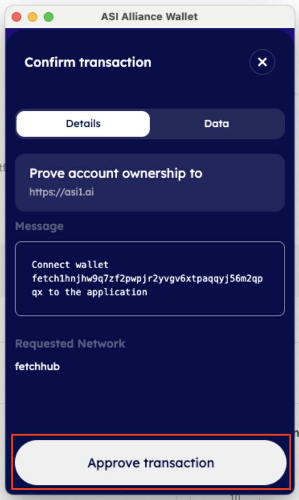
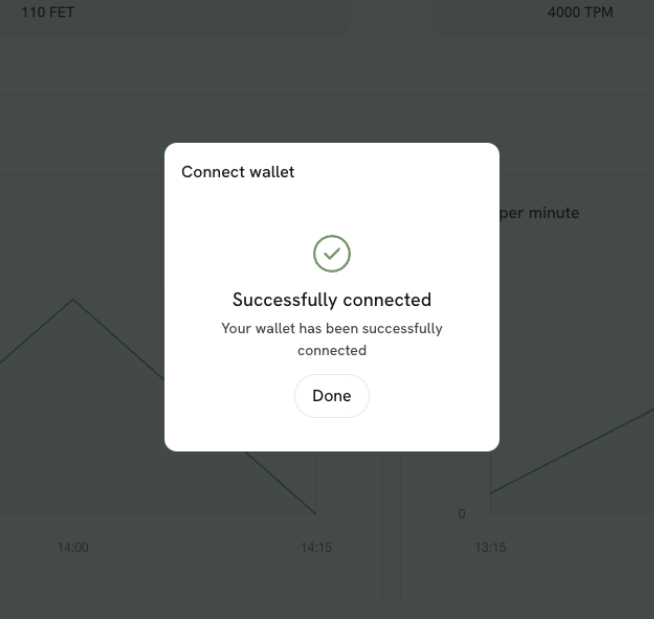
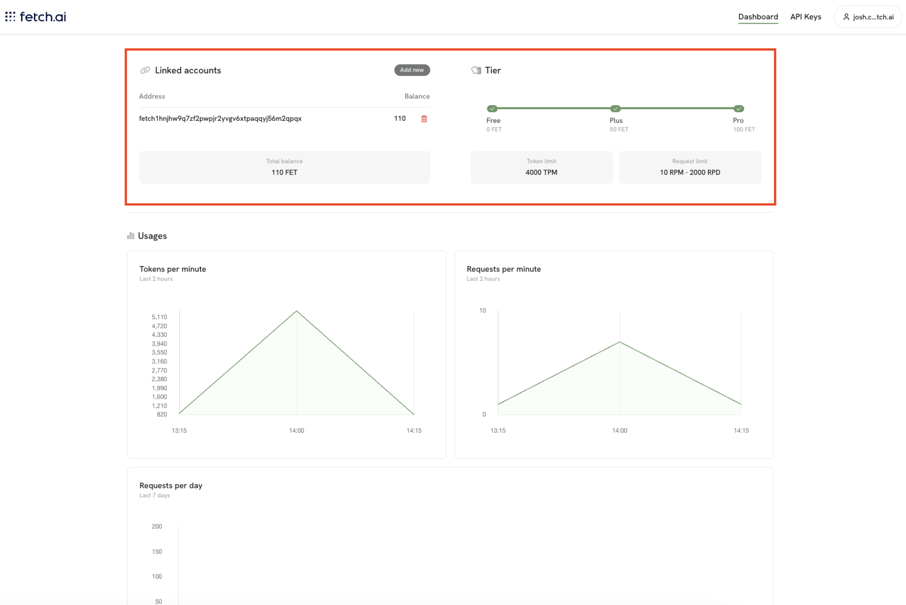

# Link Account
To get faster requests, and remove the limits from the free account you will need to link your ASI or Ethereum wallet.

## Link

Head over to the [ASI1 Dashboard](https://asi1.ai/dashboard). 

You will see a view similar to the following:

Click **Add new wallet**, and select a wallet provider. You can choose between [ASI Wallet](https://fetch.ai/docs/network/docs/guides/asi-wallet/web-wallet/get-started) and [Metamask](https://metamask.io/en-GB). 

In this example we use ASI Wallet:

**Confirm** the action:

See the successful action:

See that now we have unlocked **Plus** and **Pro** tier as the balance we have available is 110 FET:

