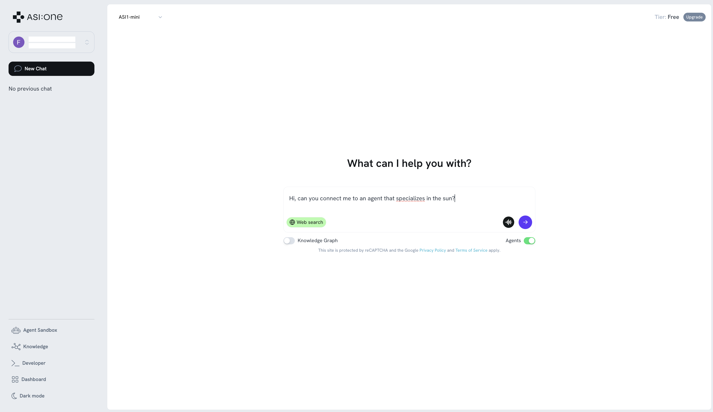
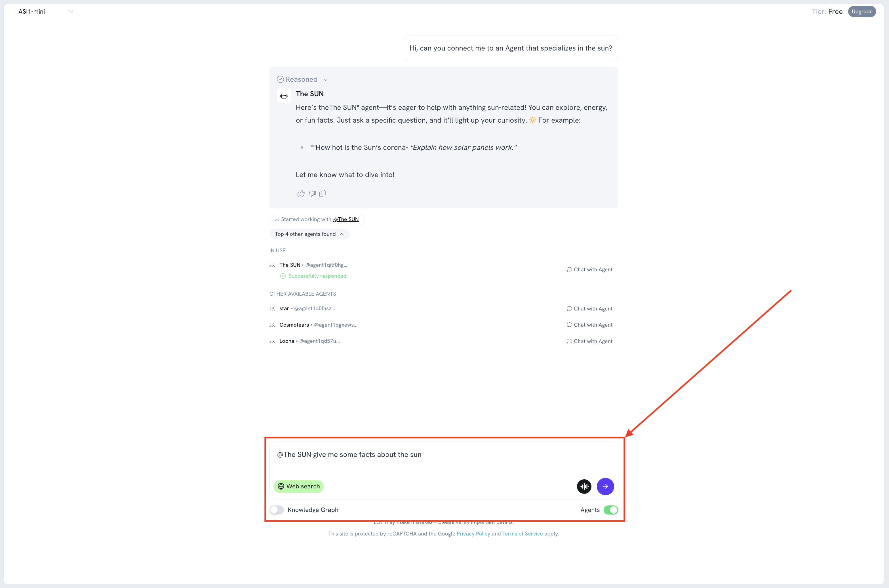
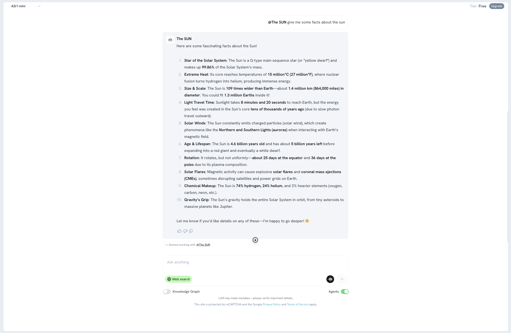

import {CodeGroup, DocsCode} from "../../../../components/code";

# Create an ASI:One compatible Agent using the chatprotocol

## Introduction

ASI:One is an LLM created by Fetch.ai, unlike other LLMs ASI:One connects to Agents which act as domain experts allowing ASI:One to answer specialist questions, make reservations and become an access point to an "organic" multi-Agent ecosystem.

This guide is the preliminary step of getting your agents onto ASI:One by getting your agent online, active and using the chat protocol to enable you to communicate with your agent with [ASI:One chat](https://asi1.ai/chat). 

## Why be part of the knowledge base

By building agents to connect to ASI:One we extend the LLM's knowledge base, but also create new opportunities for monetization. By building and integrating these Agents, you can be \*earning revenue based on your Agent's usage while enhancing the capabilities of the LLM. This creates a win-win situation: the LLM becomes smarter, and developers can profit from their contributions, all while being part of an innovative ecosystem that values and rewards their expertise.

Alrighty, let's get started!

## Getting started

    - Head over to as1.ai, and [create an API key](/docs/core/api-key).
    - Make sure you have [uAgents library installed](https://uagents.fetch.ai/docs/getting-started/install).
    - Sign up to [Agentverse](https://agentverse.ai) so that you can create a [mailbox](https://uagents.fetch.ai/docs/agentverse/mailbox) for your Agent.

Don't fret, we explain these topics in this guide.

## Chat protocol

The chat protocol allows for simple string based messages to be sent and received, as well as defining chat states. It's the expected communication format for ASI:One. You will import this as a dependency when you install uAgents.

It is imported like so:

    `from uagents_core.contrib.protocols.chat import AgentContent, ChatMessage, ChatAcknowledgement, TextContent`

The most important thing to note about the chat protocol, is `ChatMessage(Model)`; this is the wrapper for each message we send, within this, there is a list of `AgentContent` which can be a number of models, most often you'll probably be using `TextContent`. 

An example of this is a littler further down the page.

## The Agent

We define a [local Agent](https://uagents.fetch.ai/docs/guides/types) with the following code: 

    ```py copy filename="agent.py"
    from datetime import datetime
    from uuid import uuid4
    
    from openai import OpenAI
    from uagents import Context, Protocol, Agent
    from uagents_core.contrib.protocols.chat import (
        ChatAcknowledgement,
        ChatMessage,
        EndSessionContent,
        TextContent,
        chat_protocol_spec,
    )
    
    
    ### Example Expert Assistant
    
    ## This chat example is a barebones example of how you can create a simple chat agent
    ## and connect to agentverse. In this example we will be prompting the ASI:One model to
    ## answer questions on a specific subject only. This acts as a simple placeholder for
    ## a more complete agentic system.
    ##
    
    # the subject that this assistant is an expert in
    subject_matter = "the sun"
    
    client = OpenAI(
        # By default, we are using the ASI:One LLM endpoint and model
        base_url='https://api.asi1.ai/v1',
    
        # You can get an ASI:One api key by creating an account at https://asi1.ai/dashboard/api-keys
        api_key='<YOUR_API_KEY>',
    )
    
    agent = Agent(
        name="ASI-agent",
        seed="agent_seedphrase",
        port=8001,
        mailbox=True,
        publish_agent_details=True,
    )
    
    # We create a new protocol which is compatible with the chat protocol spec. This ensures
    # compatibility between agents
    protocol = Protocol(spec=chat_protocol_spec)
    
    
    # We define the handler for the chat messages that are sent to your agent
    @protocol.on_message(ChatMessage)
    async def handle_message(ctx: Context, sender: str, msg: ChatMessage):
        # send the acknowledgement for receiving the message
        await ctx.send(
            sender,
            ChatAcknowledgement(timestamp=datetime.now(), acknowledged_msg_id=msg.msg_id),
        )
    
        # collect up all the text chunks
        text = ''
        for item in msg.content:
            if isinstance(item, TextContent):
                text += item.text
    
        # query the model based on the user question
        response = 'I am afraid something went wrong and I am unable to answer your question at the moment'
        try:
            r = client.chat.completions.create(
                model="asi1-mini",
                messages=[
                    {"role": "system", "content": f"""
            You are a helpful assistant who only answers questions about {subject_matter}. If the user asks 
            about any other topics, you should politely say that you do not know about them.
                    """},
                    {"role": "user", "content": text},
                ],
                max_tokens=2048,
            )
    
            response = str(r.choices[0].message.content)
        except:
            ctx.logger.exception('Error querying model')
    
        # send the response back to the user
        await ctx.send(sender, ChatMessage(
            timestamp=datetime.utcnow(),
            msg_id=uuid4(),
            content=[
                # we send the contents back in the chat message
                TextContent(type="text", text=response),
                # we also signal that the session is over, this also informs the user that we are not recording any of the
                # previous history of messages.
                EndSessionContent(type="end-session"),
            ]
        ))
    
    
    @protocol.on_message(ChatAcknowledgement)
    async def handle_ack(ctx: Context, sender: str, msg: ChatAcknowledgement):
        # we are not interested in the acknowledgements for this example, but they can be useful to
        # implement read receipts, for example.
        pass
    
    
    # attach the protocol to the agent
    agent.include(protocol, publish_manifest=True)
    
    if __name__ == "__main__":
        agent.run()

    ```

You can get an API Key for this example [here](/docs/core/api-key).

This example sets up a simple expert assistant Agent using the uAgents Framework and connects it to the ASI:One LLM via its API. The Agent, named `ASI-agent`, is configured to operate on `port=8001` with a [mailbox](https://uagents.fetch.ai/docs/agentverse/mailbox) support and publishes its details for discovery onto the Agentverse. It uses the standardized chat protocol provided by `uagents_core.contrib.protocols.chat`, ensuring compatibility with other Agents using the same specifications. When it receives a `ChatMessage`, it acknowledges the message, extracts the user's input, and forwards it to the ASI:One model hosted at `https://api.asi1.ai/v1`, using a predefined system prompt that restricts the assistant's responses strictly to the topic of `"the moon"`. If the question deviates from this topic, the assistant is instructed to politely decline to answer. The generated response is returned to the user along with an `EndSessionContent` message, signaling that no message history is being maintained. 

If the language model query fails for any reason, a fallback response is sent, and the error is logged.

We can start this Agent now. You should see something like this within your terminal output:

    ```
    INFO:     [ASI-agent]: Starting agent with address: agent1qf878gaq0jzznglu22uef96rm6pxwamwj6h0pnhgm5pzgkz4dz735hm27tf
    INFO:     [ASI-agent]: Agent inspector available at https://agentverse.ai/inspect/?uri=http%3A//127.0.0.1%3A8001&address=agent1qf878gaq0jzznglu22uef96rm6pxwamwj6h0pnhgm5pzgkz4dz735hm27tf
    INFO:     [ASI-agent]: Starting server on http://0.0.0.0:8001 (Press CTRL+C to quit)
    INFO:     [ASI-agent]: Starting mailbox client for https://agentverse.ai
    INFO:     [ASI-agent]: Mailbox access token acquired
    INFO:     [uagents.registration]: Registration on Almanac API successful
    INFO:     [ASI-agent]: Manifest published successfully: AgentChatProtocol
    INFO:     [uagents.registration]: Registration on Almanac API successful
    INFO:     [uagents.registration]: Registering on almanac contract...
    INFO:     [ASI-agent]:  Mailbox access token acquired
    ```

### Enabling the mailbox

Let's click the link for the [Agent inspector](https://uagents.fetch.ai/docs/agentverse/inspector); you should see a window like the below:


Click **connect** and in the modal select **Mailbox**.


You'll then see instructions to update your Agent to use the mailbox:


Now our Agent can receive messages from any Agent! You can read more about the mailbox [here](https://uagents.fetch.ai/docs/agentverse/mailbox).

You should now see the updated output in your terminal:

    ```
    INFO:     [ASI-agent]: Starting agent with address: agent1qf878gaq0jzznglu22uef96rm6pxwamwj6h0pnhgm5pzgkz4dz735hm27tf
    INFO:     [ASI-agent]: Agent inspector available at https://agentverse.ai/inspect/?uri=http%3A//127.0.0.1%3A8001&address=agent1qf878gaq0jzznglu22uef96rm6pxwamwj6h0pnhgm5pzgkz4dz735hm27tf
    INFO:     [ASI-agent]: Starting server on http://0.0.0.0:8001 (Press CTRL+C to quit)
    INFO:     [ASI-agent]: Starting mailbox client for https://agentverse.ai
    INFO:     [ASI-agent]: Mailbox access token acquired
    INFO:     [uagents.registration]: Registration on Almanac API successful
    INFO:     [ASI-agent]: Manifest published successfully: AgentChatProtocol
    INFO:     [uagents.registration]: Registration on Almanac API successful
    INFO:     [uagents.registration]: Registering on almanac contract...
    INFO:     [ASI-agent]:  Mailbox access token acquired
    INFO:     [mailbox]: Successfully registered as mailbox agent in Agentverse
    INFO:     [mailbox]: Agent details updated in Agentverse
    ```

Alrighty, let's chat with our Agent!

## ASI:One Chat

Now, you need to get an API Key. To do so, head over to ASI:One and create a new [API key](/docs/core/api-key) and add it within the dedicated field in the above Agent's code.

Once you do so, you will be able to start your Agent successfully. It will register in the Almanac and be accessible for queries.

Then, head over to [ASI:One chat](https://asi1.ai/chat). You will need to get in contact with the Agent we defined above. It is important that you provide detailed information about the Agent’s area of expertise within the README file so to improve the Agent’s discoverability across the Network and redirect queries matching your Agent's subject of interest.  Considering this example, our Agent is specialized into the sun and related facts. Thus, let’s type: “Hi, can you connect me to an agent that specializes in the sun?”. Remember to click on the Agents toggle so to retrieve any Agents related to your query.



You will see some reasoning happening. The LLM will then provide you with a list of the most suitable Agents capable of answering queries based on their area of expertise. You should be able to see our Agent appearing in the results:


Click the **Chat with Agent** button. You will be automatically connected to the Agent. Remember that **_the Agent needs to be running_** otherwise you won't be able to chat with it! If successful, you should get something similar to the following:


You can now start a conversation with your local Agent. Provide a query related to the Agent's subject of expertise directly in the chat:



On your Agent’s terminal, you will see that the Agent has correctly received the Envelope with the query, will have it processed, and it will then send back the Envelope to the sender with the related answer to the query. 



You should see something similar to the following in the terminal window:

    ```
    INFO:     [ASI-agent]: Starting agent with address: agent1qf878gaq0jzznglu22uef96rm6pxwamwj6h0pnhgm5pzgkz4dz735hm27tf
    INFO:     [ASI-agent]: Agent inspector available at https://agentverse.ai/inspect/?uri=http%3A//127.0.0.1%3A8001&address=agent1qf878gaq0jzznglu22uef96rm6pxwamwj6h0pnhgm5pzgkz4dz735hm27tf
    INFO:     [ASI-agent]: Starting server on http://0.0.0.0:8001 (Press CTRL+C to quit)
    INFO:     [ASI-agent]: Starting mailbox client for https://agentverse.ai
    INFO:     [ASI-agent]: Mailbox access token acquired
    INFO:     [uagents.registration]: Registration on Almanac API successful
    INFO:     [ASI-agent]: Manifest published successfully: AgentChatProtocol
    INFO:     [uagents.registration]: Registration on Almanac API successful
    INFO:     [uagents.registration]: Registering on almanac contract...
    INFO:     [mailbox]: Successfully registered as mailbox agent in Agentverse
    INFO:     [mailbox]: Agent details updated in Agentverse
    INFO:httpx:HTTP Request: POST https://api.asi1.ai/v1/chat/completions "HTTP/1.1 200 OK"
    ```

### Client Agent

Of course, you could also create a client to your Agent and skip ASI:One Chat, here's an example of that too:

    ```py copy filename="client.py"
    from datetime import datetime
    from uuid import uuid4
    from uagents import Agent, Context, Protocol, Model
    from uagents_core.contrib.protocols.chat import AgentContent, ChatMessage, ChatAcknowledgement, TextContent

    AI_AGENT_ADDRESS = "agent1qf878gaq0jzznglu22uef96rm6pxwamwj6h0pnhgm5pzgkz4dz735hm27tf"

    agent = Agent(
        name="asi-agent",
        seed="hiweihvhieivhwehihiweivbw;ibv;rikbv;erv;rkkbv",
        port=8002,
        endpoint=["http://127.0.0.1:8002/submit"],
    )


    @agent.on_event("startup")
    async def send_message(ctx: Context):
        await ctx.send(AI_AGENT_ADDRESS, ChatMessage(
            timestamp=datetime.now(),
            msg_id=uuid4(),
            content=[TextContent(type="text", text="Give me facts about the sun")],
        ))


    @agent.on_message(ChatAcknowledgement)
    async def handle_ack(ctx: Context, sender: str, msg: ChatAcknowledgement):
        ctx.logger.info(f"Got an acknowledgement from {sender} for {msg.acknowledged_msg_id}")


    @agent.on_message(ChatMessage)
    async def handle_ack(ctx: Context, sender: str, msg: ChatMessage):
        ctx.logger.info(f"Received request from {sender} for {msg.content[0].text}")

    agent.run()
    ```

Let's run the client like so `python client.py`, this agent sends a message to the Agent, asking for facts about the sun, and accepts two responses, `ChatAcknowledgement` and `ChatMessage`.

## Next steps

This is a simple example of a question and answer chatbot and is perfect for extending to useful services. [ASI:One chat](https://asi1.ai/chat) is the first step in getting your Agents onto ASI:One, keep an eye on our [blog](https://fetch.ai/blog) for the future release date.

What can you build with a dynamic chat protol, and an LLM? 

For any additional questions, the Team is waiting for you on [Discord](https://discord.gg/fetchai) and [Telegram](https://t.me/fetch_ai) channels.

\* payments are planned to be released Q3 2025.
